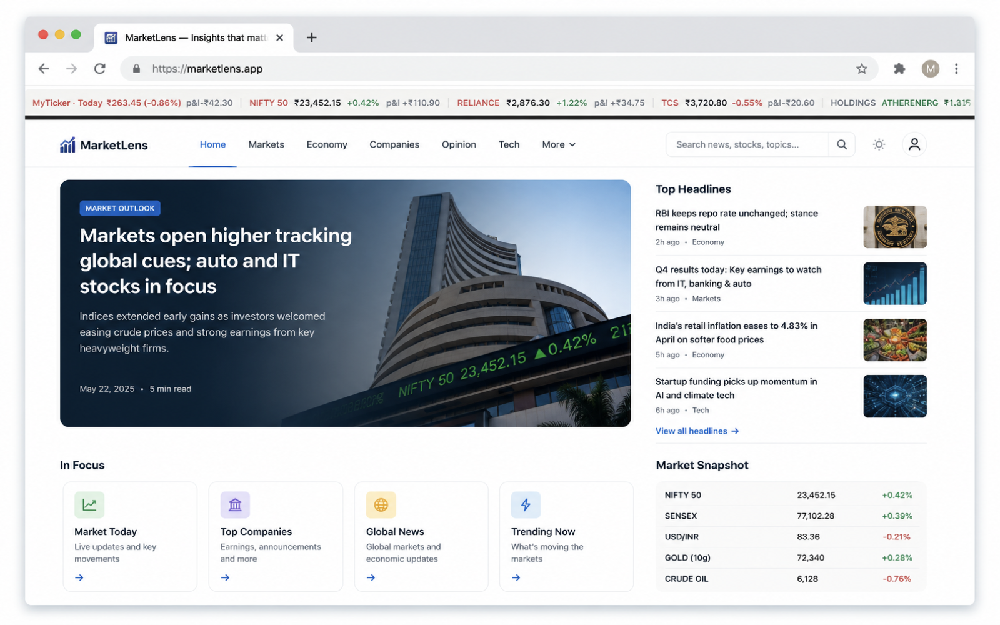
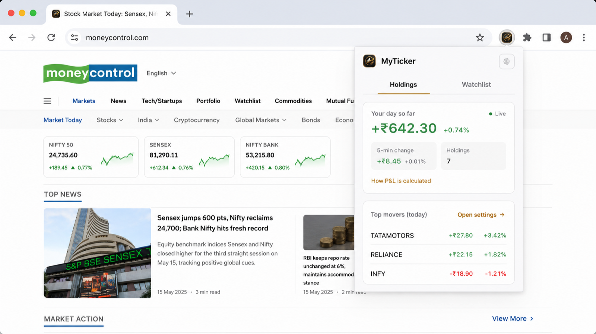
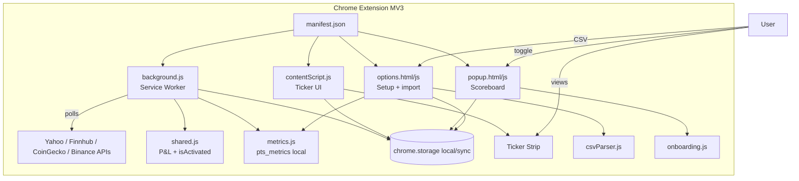

<p align="center">
  
</p>

<h1 align="center">MyTicker</h1>

<p align="center">
  <strong>Your stocks and crypto on every page — a live Ticker Tape with real portfolio P&amp;L.</strong>
</p>

<p align="center">
  
  
  
</p>

<p align="center">
  
</p>

<p align="center">
  
</p>

<p align="center">
  <em>Left to right: ambient Ticker Tape on the web · popup day P&amp;L while you browse.</em>
</p>

---

## Start here

### What it is

MyTicker is a small Chrome extension. After you connect a free price key and drop in your broker holdings file, a thin strip at the top of every tab shows your stocks and crypto with **today’s P&amp;L**. The popup shows the same numbers in a bigger “scoreboard” view.

Nothing about your portfolio is sent to MyTicker servers — **there are no MyTicker servers**. Holdings stay in this browser and the optional Finnhub key is encrypted locally; only derived unlock material lives for the current browser session, so you unlock it again after a restart. There is no portfolio telemetry.

### What problems it solves

- You want a **quick glance** at how your portfolio is doing without opening a broker app on every tab switch.
- Setup should feel like a **short checklist**, not a maze of settings.
- You care that **money data stays local**.

### Install and first use (about 2 minutes)

**Easiest — from the latest release**

1. Open [Releases](https://github.com/harshabala/MyTicker/releases/latest) and download **`MyTicker-v0.5.0-extension.zip`**
2. Unzip → you get a `MyTicker` folder
3. Chrome → `chrome://extensions` → enable **Developer mode**
4. **Load unpacked** → select that `MyTicker` folder
5. Settings opens → import holdings and go live

**Or from source**

1. Clone the repo:
   ```bash
   git clone https://github.com/harshabala/MyTicker.git
   ```
2. Open Chrome → `chrome://extensions`
3. Turn on **Developer mode** (top right)
4. Click **Load unpacked** → choose the MyTicker folder
5. The **Settings** page opens on first install

Then complete the three steps (same order in popup and Settings):

1. **Connect price data** — get a free key at [finnhub.io](https://finnhub.io/register), paste it, **Save**, optionally **Test connection**
2. **Import your holdings** — export holdings CSV from **Zerodha** (recommended). Or try first with **Download a sample Zerodha CSV** in Settings. Drop the file on the drop zone. Groww / Upstox / generic CSV are under **More formats**
3. **See it live** — open any website. The strip appears at the top. Click the extension icon for **Your day so far** / today’s P&amp;L

You can also toggle the strip with the keyboard shortcut shown in the popup (often `Ctrl+Shift+Y` / `⌘+Shift+Y`).

### When something goes wrong

| Situation | What to do |
|-----------|------------|
| Popup stuck on checklist | Finish the incomplete step (it always names the next one) |
| “Waiting for market data” | Confirm the API key, wait for a refresh, or use **Test connection** |
| CSV import fails | Use the sample Zerodha file first; open **More formats** if your broker isn’t Zerodha |
| Strip not visible | Flip **Show ticker** on in the popup; reload the tab |
| Indian symbols look wrong | Zerodha imports append `.NS` for NSE automatically — re-import if needed |

**Privacy on every stats surface:** *Stored only in this browser. Never uploaded.*

---

## For technical users

### Architecture



### How it works

1. **Holdings** land in `chrome.storage.local` (`pts_holdings`) via `csvParser.js` presets (Zerodha golden path + Groww/Upstox/generic).
2. **background.js** polls Yahoo Finance (`query1.finance.yahoo.com` / `query2.finance.yahoo.com`) for Indian equities, Finnhub (`finnhub.io`) for unlocked US-equity quotes, CoinGecko (`api.coingecko.com`) for crypto, and Binance (`data-api.binance.vision`) only as the mapped crypto fallback. It merges snapshots in `shared.js` and writes `pts_positions_state`.
3. **contentScript.js** runs on all pages at document start to render the strip and reserve space before page content; it does not read page content. Its closed Shadow DOM loads only the `ticker.css` web-accessible stylesheet.
4. **popup.js** is a small view machine: checklist → P&amp;L scoreboard (or empty). First success shows **Your day so far**, then normal **Today’s P&amp;L**.

### Metrics and activation (local-first)

Single activation constant in `shared.js`:

```js
ACTIVATION_EVENT = "myticker_activated"
// activated = api_ok AND holdings_count >= 1 AND ticker_enabled
//             AND >= 1 successful price refresh
```

Stored only in `pts_metrics` (never uploaded):

| Field | Meaning |
|-------|---------|
| `activatedAt` | First time `isActivated(...)` became true |
| `firstRefreshAt` | First successful quote fetch |
| `activeDays` | Local `YYYY-MM-DD` stamps with ≥1 successful refresh while enabled (cap 400) |
| `imports[preset]` | `{ success, fail }` for import success rate by broker |

Writer: **background.js** for refresh/activation; **options.js** for import outcomes. Popup/options only read.

### Features (deep)

| Feature | Detail |
|---------|--------|
| Live ticker strip | Dark bar, 5-min + day P&amp;L per symbol |
| Scoreboard popup | Aggregate day P&amp;L, top 3 movers by \|day %\|, strip status, method + privacy copy |
| Setup spine | API → holdings → live; incomplete rows are CTAs |
| Zerodha golden path | Sample CSV + auto `.NS`; other brokers under details |
| Crypto (optional) | CoinGecko primary with mapped Binance fallback; core loop works without it |
| Local privacy | Keys/holdings local; footer names Finnhub honesty |

### Dev install and tests

```bash
# Unit tests (pure P&amp;L + activation helpers)
node test_fixtures/test_shared.mjs
node test_fixtures/test_content_telemetry_bridge.mjs
node test_fixtures/test_ticker_render.mjs
node test_fixtures/test_content_script_classic.mjs

# Syntax check ES modules
for f in background.js contentScript.js shared.js popup.js options.js onboarding.js csvParser.js priceProviders.js metrics.js; do
  node --input-type=module --check < "$f" && echo "OK $f"
done
```

Load unpacked from the repo root. Manual E2E: save key → import `test_fixtures/sample_holdings_zerodha.csv` → keep popup open until first poll.

Task checklist: [docs/TASKS.md](docs/TASKS.md) · Privacy: [PRIVACY.md](PRIVACY.md)

### Storage / privacy notes

- Canonical API-key vault: `pts_finnhub_vault` in **local** storage, encrypted with your unlock code (not sync). Only derived unlock material is held in **session** storage and it is cleared on browser restart.
- Metrics are counts and dates only — no symbols, quantities, prices, or portfolio telemetry.
- Network: Yahoo Finance (`query1.finance.yahoo.com`, `query2.finance.yahoo.com`), Finnhub (`finnhub.io`), CoinGecko (`api.coingecko.com`), and mapped Binance fallback (`data-api.binance.vision`). No product telemetry.

### Project structure

```
MyTicker/
├── manifest.json
├── background.js / contentScript.js / shared.js / metrics.js
├── onboarding.js / csvParser.js / priceProviders.js
├── popup.html / popup.js
├── options.html / options.js
├── ticker.css / brand.css / motion.css
├── docs/TASKS.md
├── PRIVACY.md
└── test_fixtures/
```

## License

[MIT](LICENSE) © 2026 MyTicker Contributors
