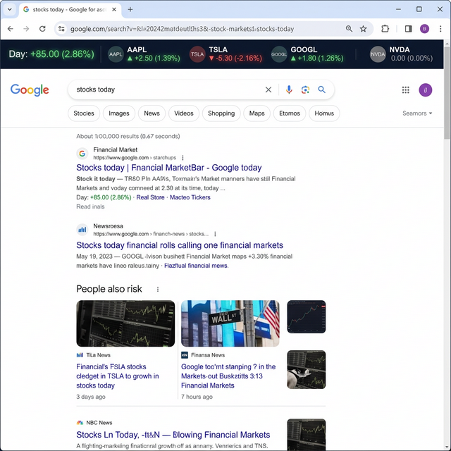
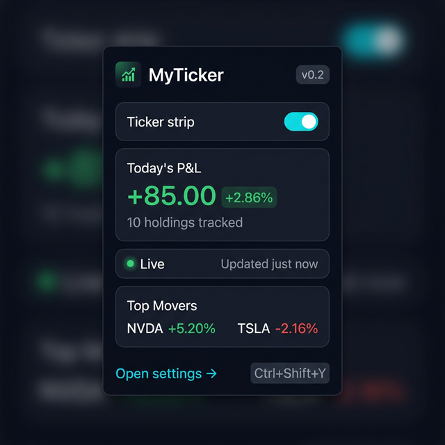
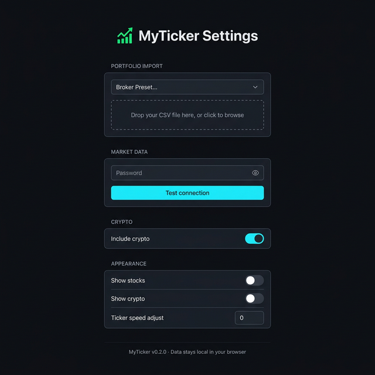
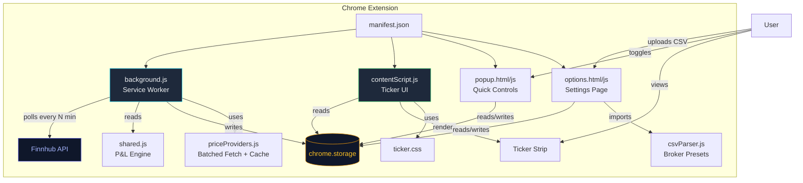

<p align="center">
  
</p>

<h1 align="center">MyTicker</h1>

<p align="center">
  <strong>A live stock & crypto ticker strip for your browser.</strong><br/>
  See your portfolio's 5-minute and daily P&L on every tab, powered by real-time market data.
</p>

<p align="center">
  
  
  
</p>

---

## ✨ Features

| Feature | Description |
|---------|-------------|
| **Live Ticker Strip** | A sleek dark bar at the top of every page with scrolling stock & crypto prices |
| **5-min & Daily P&L** | See both short-window and full-day profit/loss for each holding |
| **Multi-Broker CSV Import** | Drag-and-drop CSV files from Zerodha, Groww, Upstox, or any generic format |
| **Crypto Support** | Track Top 5 coins or add your own crypto holdings manually |
| **One-Click Toggle** | Enable/disable via popup or `Ctrl+Shift+Y` keyboard shortcut |
| **Premium Dark UI** | Glassmorphism popup, Apple-style settings, glow effects on the ticker |
| **100% Local Data** | Your holdings and API keys never leave your browser |
| **Test Connection** | Validate your API key with one click before going live |

## 📸 Screenshots

### Ticker Strip
A minimal, always-visible bar showing your portfolio performance on every page.



### Popup
At-a-glance P&L summary, top movers, and live status — one click away.



### Settings
Apple-style configuration with drag-and-drop CSV import and connection testing.



## 🏗 Architecture



### Data Flow

```
CSV Upload → csvParser.js → chrome.storage.local (holdings)
                                       ↓
           background.js (alarm poll) → priceProviders.js → Finnhub API
                                       ↓
           shared.js (P&L engine) → chrome.storage.local (positionsState)
                                       ↓
           contentScript.js → Renders ticker strip on every page
```

## 🚀 Installation

### From Source (Developer Mode)

1. Clone the repo:
   ```bash
   git clone https://github.com/harshabala/myticker-extension.git
   ```
2. Open Chrome → `chrome://extensions`
3. Enable **Developer Mode** (top right toggle)
4. Click **Load unpacked** → select the cloned folder
5. Click the MyTicker icon in your toolbar

### Setup

1. **Get a free API key** from [finnhub.io](https://finnhub.io) (takes 30 seconds)
2. Open **MyTicker Settings** → paste your API key → click **Test connection**
3. **Import holdings**: drag-and-drop your broker's CSV export, or add crypto manually
4. Visit any webpage — your ticker strip appears at the top!

## 📁 Project Structure

```
MyTicker/
├── manifest.json          # Extension manifest (MV3)
├── background.js          # Service worker: polling, P&L orchestration
├── contentScript.js       # Injected ticker strip UI
├── shared.js              # Core P&L engine + shared utilities
├── priceProviders.js      # Finnhub API client (batched + cached)
├── csvParser.js           # CSV parser with broker presets
├── brokerAdapters.js      # Broker API stubs (future: live sync)
├── popup.html / popup.js  # Extension popup UI
├── options.html / options.js  # Settings page UI
├── ticker.css             # Ticker strip styles + animations
├── icons/                 # Extension icons (16/32/48/128px)
├── assets/                # README screenshots
└── test_fixtures/         # Test CSVs + unit tests
```

## 🧪 Testing

Run the unit test suite for the core P&L engine:

```bash
node test_fixtures/test_shared.mjs
```

```
36 passed, 0 failed
```

Tests cover: price snapshot merging, P&L calculations, stale data pruning, edge cases (null values, empty holdings, NaN inputs).

## 🔒 Privacy

- **All data stays local** in `chrome.storage` — nothing is sent to any server except Finnhub for price quotes.
- Your API key is stored in `chrome.storage.local` (never synced across devices).
- No analytics, no tracking, no telemetry.
- See [PRIVACY.md](PRIVACY.md) for the full privacy policy.

## 🗺 Roadmap

- [ ] Live broker API integrations (Zerodha Kite, Groww, Upstox)
- [ ] Light theme for the ticker strip
- [ ] Multiple watchlists
- [ ] Intraday sparkline charts in the popup
- [ ] Alerts & notifications for price targets
- [ ] Firefox / Edge support

## 📄 License

[MIT](LICENSE) © 2026 MyTicker Contributors
