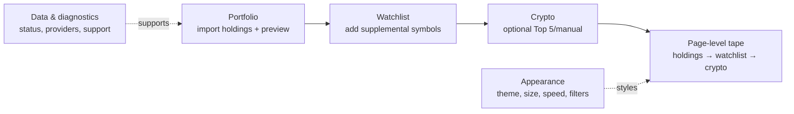

# MyTicker information architecture handoff

Source baseline: commit `98c276f`, including the final simplified popup and gold-surface refinement. This describes the implemented extension, not a future product proposal.

## Product map and screen ownership

| Surface | Owns | Does not own | Rationale |
| --- | --- | --- | --- |
| Popup | At-a-glance holdings P&L, top movers, and read-only watchlist quote review with removal. | Adding instruments, watchlist setup, and tape controls. | A compact review surface should answer “how is my portfolio?” first; its single header gear leads to Settings. |
| Settings: Portfolio | Broker CSV import and holdings preview. | Watchlist, crypto, provider credentials. | Holdings are the product’s primary data and the shortest India-first route to a usable tape. |
| Settings: Watchlist | Add and configure supplemental symbols by India/US/index/ETF/crypto type. | Core holdings import. | Watchlist is secondary market tracking, after owned positions; Settings owns additions. |
| Settings: Crypto | Optional Top 5/manual canonical crypto selection. | General watchlist setup and credentials. | Crypto is a distinct, optional third tape group with its own provider rules. |
| Settings: Data & diagnostics | Setup status, Yahoo/Finnhub data configuration, diagnostic output, change notes, help/troubleshooting, in-session errors. | Day-to-day portfolio edits. | Operational/support information is lower-frequency and placed last. |
| Settings: Appearance | Tape visibility filters, theme, speed, and tape size. | Data/provider controls. | Tape controls and visual preferences belong with the shared tape experience, not the popup. |
| Page-level tape | Persistent, compact market summary across eligible pages. | Browser toolbar/chrome controls. | It is injected by the content script at the top of a webpage in a closed Shadow DOM; it is explicitly **not browser chrome**. |

## Settings hierarchy

The settings page has one five-tab task hierarchy, in this exact visual and keyboard order:

1. **Portfolio** — import and validate holdings.
2. **Watchlist** — add secondary instruments.
3. **Crypto** — opt into and select the third tape group.
4. **Data & diagnostics** — configure/check data and get help.
5. **Appearance** — tune the tape’s presentation.

This order is deliberate: holdings first because personal P&L and the primary tape group depend on them; watchlist second because it supplements holdings; crypto third because it is optional and rendered after the first two groups; data/diagnostics last because provider setup, status, technical notes and troubleshooting are support/operational tasks rather than the primary setup path. Appearance remains a separate final preference surface.

The tab implementation supports click, Arrow keys, Home/End, URL hash and browser Back/Forward. Legacy `#setup`, `#market`, `#diagnostics`, and `#tips` hashes resolve to `#data`; an empty hash resolves to `#portfolio`.



## Popup structure

```text
MyTicker header
├─ Settings gear (opens options page)
└─ Tabs, when setup has positions
   ├─ Holdings (default)
   │  ├─ daily P&L hero + live/stale state
   │  ├─ 5-minute change + holdings count
   │  ├─ top movers (up to three)
   └─ Watchlist
      ├─ empty-state instruction directing additions to Settings, or
      └─ symbol, market/currency metadata, quote/change, remove
```

Before setup completion, the popup replaces tabs with the checklist (import holdings, prices loading, and an optional US-key item only when needed). If setup is complete but no position state exists, it shows the holdings empty state. The first paint uses `Loading…` while storage/setup reads resolve.

Gold is the interaction accent across the popup and Settings: selected tab underlines, primary actions, links, hover, and keyboard focus. Green and red retain their semantic roles for positive/success and negative/error market states, rather than indicating selection.

## Tape structure and state

```text
Page-level tape
├─ optional stale status
├─ aggregate: MyTicker daily P&L (or mixed-currency fallback)
└─ scroll/focusable market items
   ├─ holdings (group marker on first group item)
   ├─ watchlist (second)
   └─ crypto (third, only when enabled)
```

Each tape item shows display name, quote price, percent change, and `p&l` only for holdings; it may show `stale`. Empty state says to add holdings or a watchlist; unresolved state says `Updating markets`. Focus pauses scrolling; reduced-motion mode is static and scrollable. Fullscreen video hides the tape.

## Entry points and user flows

| Goal | Entry point | Flow | Destination/outcome |
| --- | --- | --- | --- |
| Import holdings | Settings → Portfolio, popup checklist, or Settings header route | `Import my holdings` / demo sample / local CSV → parser/preset → preview → immediate poll | Holdings become first tape group and populate popup P&L after prices load. |
| Add watchlist | Settings → Watchlist | Choose market/exchange → enter canonical symbol or supported crypto → `Add to watchlist` | Item appears as the second tape group; the popup Watchlist tab reviews quote state and permits removal. |
| Enable/select crypto | Settings → Crypto | Choose Off/Top 5/Manual → search/add/remove canonical coins if Manual → Save | Crypto uses CoinGecko first and Binance fallback for mapped liquid assets; it becomes tape group three. |
| Configure/check data | Settings → Data & diagnostics | Review setup status → test Yahoo India or save/test Finnhub US key → Refresh/Copy diagnostics | India `.NS`/`.BO` quotes use Yahoo automatically; configured US equities use Finnhub; safe diagnostics can be shared. |
| Change theme/tape size | Settings → Appearance | Choose System/Light/Dark, speed, Compact/Comfortable/Large and filters → Save | Shared visual configuration is applied to the page-level tape (and theme to popup/settings). |
| Tune tape | Settings → Appearance | Choose stock/crypto visibility, theme, speed, and Compact/Comfortable/Large size → Save | The page-level tape uses the saved presentation controls; the popup has no tape controls. |

## Provider ownership and truthful scope

| Provider | Screen ownership / visible statement | Implemented scope |
| --- | --- | --- |
| Yahoo Finance | Data & diagnostics India automatic card; footer/diagnostics/help | Automatic `.NS`/`.BO` India quotes; no API key. |
| Finnhub | Data & diagnostics United States optional card; US input validation; diagnostics | Configured US equities; free key is described as required for live US prices. It is not presented as a crypto provider. |
| CoinGecko | Crypto guidance, diagnostics, footer/change notes | Primary source for supported canonical crypto. |
| Binance | Crypto guidance, diagnostics, footer/change notes | Fallback only for mapped liquid crypto pairs. |

No UI claims Coinbase or DeFiLlama as active providers; the change note explicitly says they are not implemented. Internal source labels and endpoint/catalog identifiers are implementation details, not user-facing provider claims.
